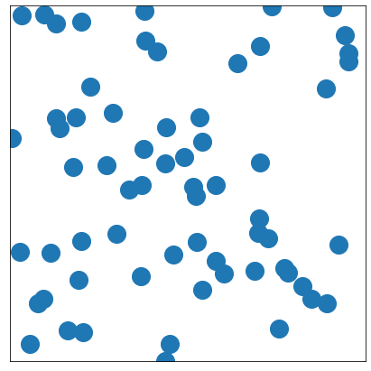
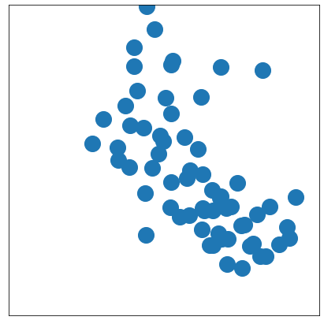
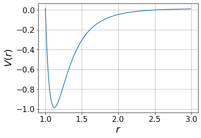
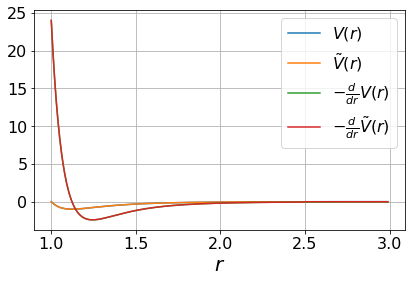

# Hardware Acceleration with Jax

To accelerate our vanderwaals gas simulations, we use the Jax library. 

In this section, we will breifly discuss how the Jax . The Jax implementation of our code can be found at https://github.com/iyaja/gastric.

## XLA and Hardware Acceleration

While all the physics simulation code in our library is written in pure Python, Jax internally accelerates computations using XLA, an intermediate representation that can be compiled to a variety of hardware accelerator targets. XLA uses an advanced linear algebra compiler that is purpose-built for automatic parallelization and acceleration of modern massicely parallel devices like GPUs and TPUs. Installing the GPU version of Jax automatically runs our code on any CUDA-compatible devices without any changes to the codebase.

## JIT Compilation

Jax further uses a Just-In_Time (JIT) compiler to compile the high level Python code into XLA. JIT compilation is a technique that compiles the code just before execution on the target hardware. This allows the compiler to optimize the code for the target hardware. Since the initial XLA compilation time might be high, Jax cache's the compiled object code so that all executions of a function after the first are automatically accelerated without any additional compile time overhead.

With XLA and JIT, we were able to implement a energy minimization simulation using the FIRE algorithm in just a few lines of Python code. Figure <> shows a rendered view of the initial and minimized systems.




## Automatic Differentiation

Automatic differentiation is a modern compiler feature that allows us to automatically compute derivates of native high-level code. We use Jax's automatic differentiation engine to make our simulation code fully differentiable and more consise.

Figure <> illustrates one usecase of automatic differentiation. After defining the vanderwaal's potential in the usual way as a simple python function, Jax's `grad` operator is used to define a new force function without manually specifying the gradient!

```python
def vanderwaals(r, rc=RC):
    v = 4 * ((1 / r) ** 12 - (1 / r) ** 6)
    vc = 4 * ((1 / rc) ** 12 - (1 / rc) ** 6)
    return v - vc

V = vanderwaals(dr)
V_cutoff = vanderwaals_cutoff(dr)
F = -vmap(grad(vanderwaals))(dr)
F_cutoff = -vmap(grad(vanderwaals_cutoff))(dr)
```




While this is just a toy example, making our simulation fully differentiable means that we open up possibilities for future work like replacing/estimating the potential/force functions with a neural network, or automatically learning/optimizing simulation parameters without any additional solver libraries.